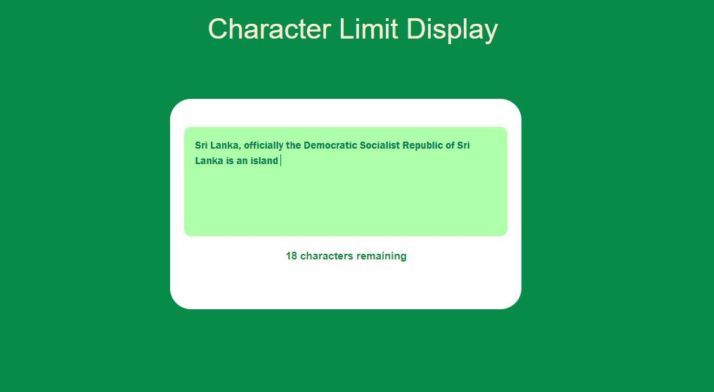

# Character-Limit-Display
Character limit display with real time typing

💻😍 Online Demo : https://character-limit-display.netlify.app/

### Table of Content
-01 [What is this?](#What) 
-02 [What are the technologies used?](#technologies) 
-03 [How to used this?](#How) 

## What is this?<a name="What"/>
This is a simple character limit counter for web form.

## What are the technologies used?<a name="technologies"/>
- HTML
- CSS
- JavaScript

## How to use this?<a name="How"/>
When you are typing in the textarea, you get a message about how many characters you can type continuously.
